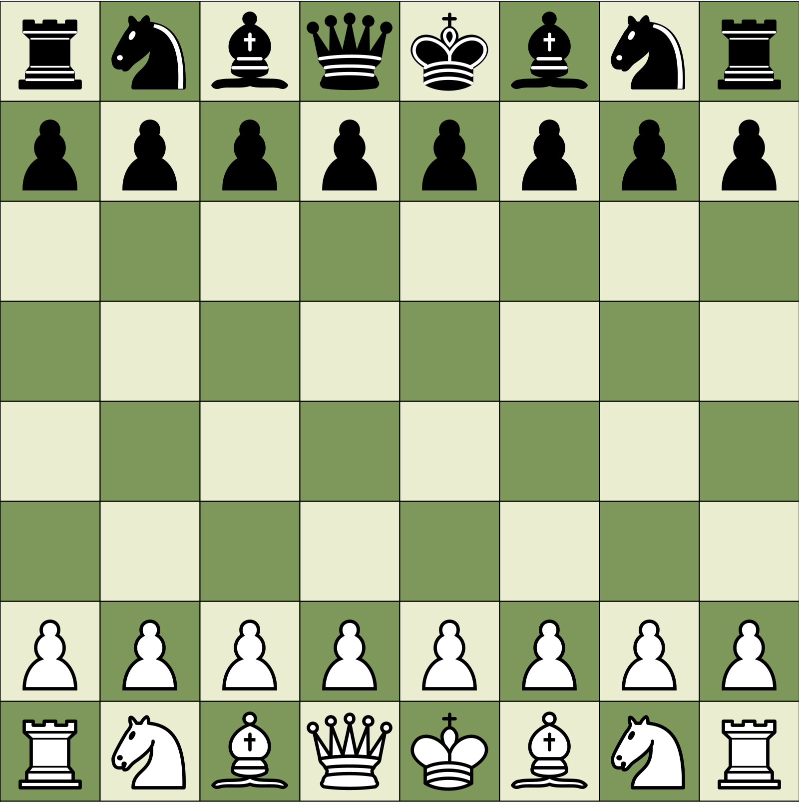

# Chess Game x Engine

This project is a chess implementation. It is one-to-one tested with Stockfish move generation, meaning that it is
perfectly implemented and all moves are properly generated.
In addition, there is an engine built based on those [heuristics](https://www.chessprogramming.org/Simplified_Evaluation_Function)
designed by Tomasz Michniewski and published in chessprogramming.com.

The engine is around 1300-1500 rated and search up to depth 4 (it can go to depth N, but takes a long time). The searching algorithm
is *minmax* with *alpha-beta pruning*.

It was built with the following tools:
- Scala (programming language)
- Processing (visuals)

The visuals were inspired by [chess.com](https://www.chess.com).

## Setup

The setup should be pretty straight forward.

- Install the project
- Setup Gradle, Scala and Java 21
- Execute `./gradlew run`

Even easier: open the project on *IntelliJ* and run the method main found on the class `ChessGame`

## Implementation

This chess implementation follows one to one what a proper chess implementation should be.
Those are the most important features:

- Color selection
- Select which piece to promote to
- Intuitive interface with legal moves indicator
- Castle
- En passant
- Stalemate
- Engine to play against
- Move generation validated with stockfish

## Future improvements

- Optimized move generation
- Optimized data structures
- Use CNN for the engine
- Three-fold repetition

## Conclusion

This was a lovely and fun project to work on. I am a chess enjoyer myself and being able to make a passion into code was
truly inspiring.

## Video
[Video on VU Panopto](https://vu.cloud.panopto.eu/Panopto/Pages/Viewer.aspx?id=a8ed02e2-8b02-46d3-8214-b30301273ace)

[Video Stalemate on VU Panopto](https://vu.cloud.panopto.eu/Panopto/Pages/Viewer.aspx?id=c1fa7562-6e73-48da-b20e-b30301290c75)

[Video Checkmate on VU Panopto](https://vu.cloud.panopto.eu/Panopto/Pages/Viewer.aspx?id=c271ca93-fcd1-40ec-948e-b30301296c15)

